# Project Jarvis Architecture

## One-page summary
Project Jarvis is a multi-agent personal assistant with a React Native client and a TypeScript backend. The backend orchestrates user-scoped agent runs, routes requests across multiple LLMs (OpenAI and Claude), invokes tools either directly or via MCP (Composio + MCP client), and exposes REST + WebSocket APIs for streaming responses and events. Memory and a knowledge graph are internal tools shared by all agents and stored in Postgres. The architecture is hexagonal end-to-end, with explicit ports for LLMs, tool invocation, MCP, memory/KG, storage, and streaming. Observability, security, and cost controls are first-class concerns, with per-tenant isolation, audit trails for tool usage, and queue-based concurrency controls.

## Assumptions
- REST for commands + WebSocket for streaming events/responses.
- Multi-tenant API with per-user orchestrators.
- Monorepo with workspace packages and shared TypeScript types.
- Postgres as primary data store for memory, knowledge graph, and audit logs.

## High-level architecture
### Components
- Mobile (React Native): capture mic/camera, send requests, stream responses.
- API: REST command ingress + WebSocket event stream.
- Orchestrator: per-user run controller; can call tools directly.
- General Agent: spawnable sub-agent executor.
- MCP Client: tool execution via MCP servers.
- Monitor Agent: safety/policy checks and termination.
- LLM Router: OpenAI/Claude routing based on policies.
- Memory/KG: internal tooling for retrieval and grounding.
- Observability: tracing, logs, audit trails.

### Data flow (mermaid)


### Agent orchestration (mermaid)

```mermaid
flowchart TD
  UserInput --> Orchestrator
  Orchestrator --> GeneralAgent
  Orchestrator --> MCPClient
  Orchestrator --> MonitorAgent
  GeneralAgent --> ToolInvoker
  ToolInvoker --> MCPClient
  MonitorAgent --> Orchestrator
```


## Hexagonal layering
### Domain (core)
- Entities: `AgentRun`, `Message`, `ToolCall`, `MemoryItem`, `KGEntity`, `KGRelation`.
- Policies: routing, safety, tool permissions, budgets.

### Application services
- `OrchestratorService`, `AgentSpawner`, `ToolExecutionService`, `MemoryService`, `KGService`, `MonitoringService`.

### Ports (interfaces)
- `LLMProviderPort`, `ToolRegistryPort`, `ToolInvokerPort`, `MCPClientPort`, `ComposioAuthPort`.
- `MemoryStorePort`, `KnowledgeGraphPort`, `EmbeddingPort`.
- `EventStreamPort`, `AuditLogPort`, `QueuePort`.

### Adapters (implementations)
- LLMs: OpenAI SDK, Claude SDK.
- MCP: Composio adapter + MCP client adapter.
- Storage: Postgres + pgvector.
- Events/queues: WebSocket + Redis/Kafka/SQS.
- Observability: OpenTelemetry exporter + structured logger.

## Backend structure
### Folder layout
```
/apps/backend
  /src
    /api
      /http
      /ws
    /domain
      /entities
      /policies
    /application
      /services
      /usecases
    /ports
    /adapters
      /llm
      /mcp
      /composio
      /memory
      /kg
      /storage
      /queue
      /observability
    /infrastructure
      /config
      /db
      /migrations
```

### Key interface contracts
- `LLMProviderPort.generate()` and `.stream()` for multi-model routing.
- `ToolInvokerPort.invoke()` for direct and MCP tool execution.
- `MemoryStorePort.search()` for retrieval; `KnowledgeGraphPort.query()` for graph traversal.
- `EventStreamPort.publish()` for streaming events to the client.

## Mobile app structure
### Folder layout
```
/apps/mobile/src
  /components
  /screens
  /features
    /assistant
    /media
  /services
  /utils
```

### Multimodal I/O pipeline
- Mic capture -> chunk/encode -> stream to backend -> receive tokens -> render/tts.
- Camera capture -> upload -> reference in agent run.
- WebSocket drives live UI state and progress.

## Agent design
- Orchestrator owns runs and policies; can call tools directly.
- General Agent runs subtasks and shares memory/KG.
- MCP Client executes external tools via MCP.
- Monitor Agent checks safety, rate limits, and policy violations.

## MCP integration
- Composio handles tool discovery and auth.
- MCP client executes tool calls.
- Cache tool schemas per user with TTL.
- Audit all tool invocations.

## Memory and knowledge graph
### Storage schema (Postgres)
- `memories(id, user_id, content, embedding, created_at)`
- `kg_entities(id, user_id, type, properties, embedding)`
- `kg_relations(id, user_id, source_id, target_id, type, properties)`
- `agent_runs(id, user_id, status, cost)`
- `tool_events(id, run_id, tool_id, input, output, ts)`

### Retrieval flow
Query -> embeddings search -> KG traversal -> merge -> response.

## API design
### REST
- `POST /v1/agent/run`
- `POST /v1/agent/:id/message`
- `POST /v1/media/audio`
- `POST /v1/media/image`
- `GET /v1/tools`
- `GET /v1/agent/:id/status`

### WebSocket events
- `agent.token`
- `agent.tool_call`
- `agent.tool_result`
- `agent.final`
- `agent.error`

## Observability
- OpenTelemetry tracing across runs and tool calls.
- Structured logs with correlation IDs.
- Audit trail for tool usage and agent actions.

## Security and privacy
- Secret management for Composio and LLM keys.
- Per-tenant isolation via user IDs and row-level policies.
- PII redaction before storage.

## Scalability
- Queue-based async tool/LLM calls.
- Per-user and global rate limits.
- Model routing for cost control.

## MVP vs future roadmap
### MVP
- Orchestrator, General Agent, basic memory + KG, REST + WS streaming.
- Small tool set, basic monitoring and auditing.

### Future
- Advanced planning and agent collaboration.
- Expanded tool marketplace.
- Personalization and offline support.
